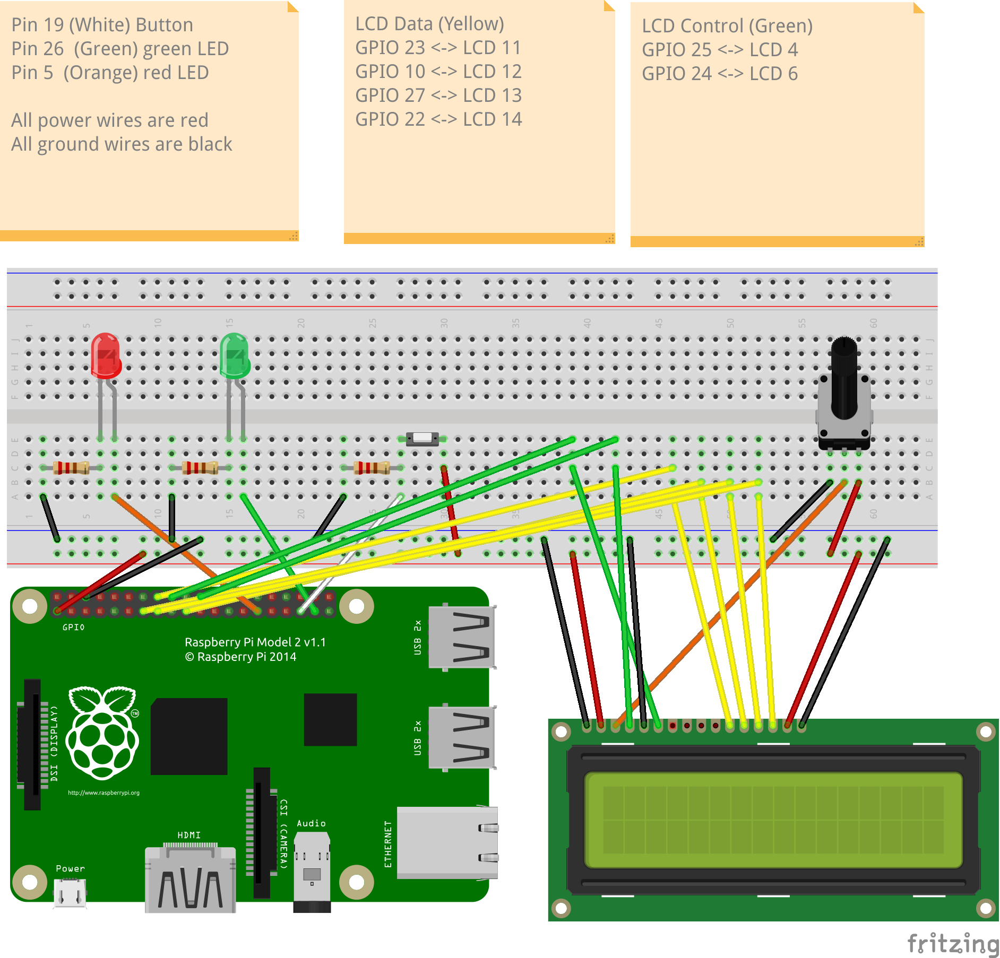

# Hardware Software University Project

Coursework in "Hardware-Software Interface" module on Systems Programming in C and ARM Assembler

This is a **pair coursework**.

Links:
- You can use any machine with an installation of the `gcc` C compiler for running the C code of the search logic
- Template for the C program: [cw2.c](cw2.c)
- Template for the ARM Assembler program: [hamming.s](hamming.s)

## Contents

This folder contains the several files for the project:
- `cw2.c`         ... the main C program with the CW implementation
- `hamming.s`     ... the Hamming function, which is implemented in ARM Assembler
- `lcd-binary.c`  ... the low-level code for hardware interaction with LED, button, and LCD, implemented in inline assembler; 
- `lcd-fcts.c`    ... the software stack for using the LCD display
- `cw2-aux.c`     ... several auxiliary functions used in `cw2.c`

Note that the default settings for constants such as sequence length etc and wiring can be found in the header file:
- `cw2-config.h`  ... constants and wiring info

## Building and running the application
**You will need to run this on a Raspberry Pi 3 and above with the correct wiring (shown in video).**
**Due to the complexity to set it all up, it is not expected to run the program but to simply showcase specific skills.**

You can build the main C program (in `cw2.c`) by typing
> make all

and run the CW implementation like this
> sudo ./cw2 

a typical test configuration (for seqlen 3 and 3 digits, exhaustive serach, secret sequence 123) is run like this:
> sudo ./cw2 -d -e -n 3 -m 3 -s 123

The general format for the command line is as follows:
```
 ./cw2 [-d] [-v] [-e] [-S <delay>] [-n <seqlen>] [-m <maxval>]
       [-u] [-s <secret sequence>] [-r <reference sequence>]
```

## Wiring

A **green LED**, as output device, should be connected to the RPi2 using **GPIO pin 26.**

A **red LED**, as output device, should be connected to the RPi2 using **GPIO pin 5.**

A **Button**, as input device, should be connected to the RPi2 using **GPIO pin 19.**

An **LCD display**, with a potentiometer to control contrast, should be wired to the
Raspberry by as shown in the Fritzing diagram below.

You will need resistors to control the current to the LED and from the Button. You
will also need a potentiometer to control the contrast of the LCD display.

The Fritzing diagram below visualises this wiring. 


